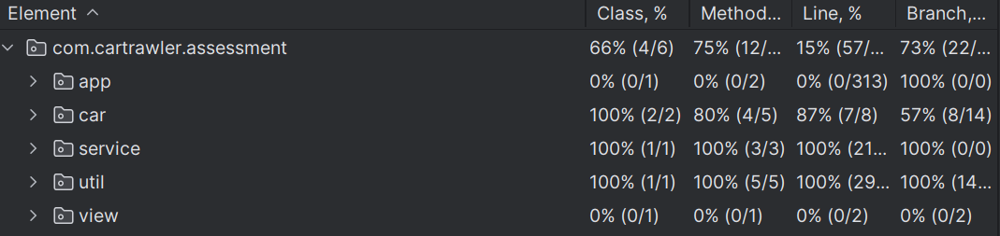
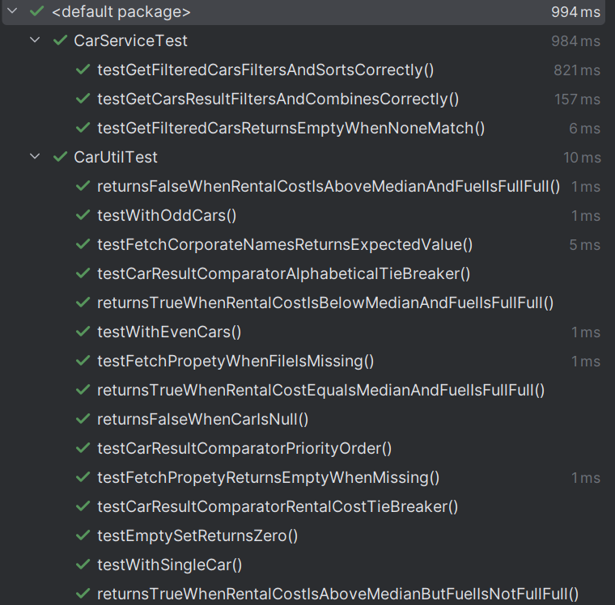

CarTrawler application - 

1) Fetching corporate names as per the value in properties file.
2) Including equals method in Record class to filter out duplicates when using distinct.
3) Partitioning set data into corporate and non corporate sets.
4) Applying the filter logic based on business logic
5) Combining the result from filtered sets so as corporate sets come first followed by non-corporate
6) Any cars having value above median value and FULLFULL fuel type are also excluded
7) Displaying the output.

Author - Vinit Vilas Sawant

- Technologies used (Java 21, Maven, JUnit, etc.)

Code coverage - 

How to run the jar- 

java -cp CarTrawler-1.0-SNAPSHOT.jar com.cartrawler.assessment.app.AssessmentRunner
